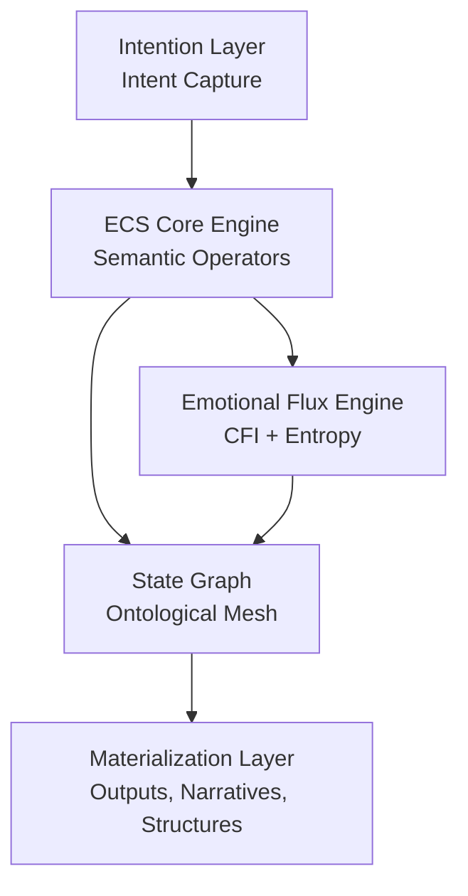
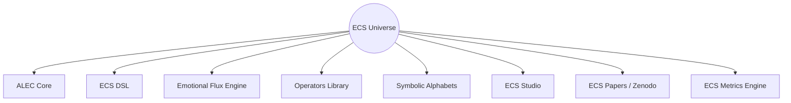

### *Meaning as Executable Matter.*

<div align="center">

<!-- Animated SVG Banner -->


</div>

---

<div align="center">

### **ECS™ — The Executable Ontology of Meaning**

[]()


<!-- Math Badges -->


</div>

---

<div align="left">

<!-- Technical-Artistic -->


</div>

> *ECS™ is a symbolic architecture for engineering meaning —
> where logic, aesthetics, and ontology converge into a unified cognitive engine.*
> *Here, meanings are not interpreted: they are **executed**.*

Inspired by formal languages, symbolic tradition, and deep cognitive dynamics, ECS transcends the “text → response” paradigm.
It operates as a **fractal ontological engine**, capable of:

* Modeling coherent mental states
* Mapping intention
* Executing symbolic operators
* Materializing narratives, structures, and universes

---

<div align="left">

<!-- Why ECS -->


</div>

ECS solves a central problem in cognitive engineering:

> **How do we transform meaning into operational structure?**

While conventional frameworks treat language as data, ECS treats language as a **living ontology**, enabling:

* Intention → Operator
* Operator → State
* State → Materialization

It is the leap from:
**“interpreting language” → “programming meaning.”**

---

<div align="left">

<!-- Architecture -->


</div>



The architecture operates in a continuous cycle:

1. **Intention**
2. **Operators**
3. **Ontological States**
4. **Materialization**

---

<div align="left">

<!-- Components -->


</div>

<div align="center">
<table>
<tr>
<td align="center"><strong>🧠 ALEC</strong><br><em>Aledev Logical & Emotional Core</em></td>
<td align="left">Unified ontology sustaining all of ECS — logical, semantic, and affective foundations.</td>
</tr>
<tr>
<td align="center"><strong>🔤 ECS DSL</strong><br><em>Domain-Specific Language</em></td>
<td align="left">Minimalist symbolic language for expressing executable meaning.</td>
</tr>
<tr>
<td align="center"><strong>💠 EFE</strong><br><em>Emotional Flux Engine</em></td>
<td align="left">Measures and models affective states integrated into cognitive coherence.</td>
</tr>
<tr>
<td align="center"><strong>📐 Operators</strong><br><em>Semantic Operator Library</em></td>
<td align="left">
⊕ expansion ·  
⊗ condensation ·  
∴ symbolic causality ·  
≡ coherence ·  
ψ narrative vortices
</td>
</tr>
<tr>
<td align="center"><strong>🧩 ECS Studio</strong><br><em>(future)</em></td>
<td align="left">Visual environment for creating and manipulating symbolic universes.</td>
</tr>
<tr>
<td align="center"><strong>📊 Metrics Engine</strong></td>
<td align="left">Computes CFI, Semantic Coherence, Flux Entropy, and Ontological Density.</td>
</tr>
</table>
</div>

---

<div align="left">

<!-- Metrics -->

-0047AB?style=for-the-badge)

</div>

<div align="center">

### ① **CFI — Cognitive Flux Index**

[
CFI = \alpha S_c + (1 - \alpha) E_r
]

</div>

Parameters:

* (S_c) — semantic coherence
* (E_r) — emotional resonance
* (\alpha = 0.6)

---

<div align="center">

### ② **Semantic Coherence**

[
S_c = 1 - \frac{\Delta d}{d_{\max}}
]

</div>

Description:
Inverse measure of semantic deviation between states.

---

<div align="center">

### ③ **Flux Entropy**

[
H_f = -\sum_i p_i \log(p_i)
]

</div>

Description:
Entropy of cognitive states during internal transitions.

---

<div align="center">

### ④ **Ontological Density**

[
D_o = \frac{|O|}{|N|}
]

</div>

Description:
Ratio between active ontological operators and total nodes available.

---

<div align="left">

<!-- Universe Map -->


</div>

*Your Galaxy of Ontological Tools.*



---

<div align="left">

<!-- Quick Start -->


</div>

### **Installation**

```bash
git clone https://github.com/ale-dev/ECS.git
cd ECS
```

### **Running a symbolic operator**

```python
from ecs import Operator

op = Operator("⊕")
state = op("expansion intention")

print(state)
```

---

<div align="left">

<!-- Examples -->


</div>

### **Create an operator**

```python
from ecs import define

@define.operator("ψ")
def vortex(x):
    return f"narrative vortex: {x}"
```

### **Run a symbolic narrative**

```python
from ecs import Narrative

n = Narrative("self-discovery")
n.expand("archetypal element")
n.resolve()
```

---

<div align="left">

<!-- Documentation -->


</div>

<div align="center">

<a href="https://github.com/aleeepassarelli/ECS">
  
</a>

<a href="https://zenodo.org/search?page=1&size=20&q=ECS">
  
</a>

<a href="https://github.com/aleeepassarelli/ECS/tree/main/ALEC">
  
</a>

<a href="https://github.com/aleeepassarelli/ECS/tree/main/examples">
  
</a>

<a href="https://github.com/aleeepassarelli/ECS/tree/main/tutorials">
  
</a>

</div>

---

<p align="center">
  <sub>
  Developed with 🧠 + 🜂 by <b>Aledev</b> • 
  <a href="https://github.com/aleeepassarelli">GitHub</a> • 
  <a href="mailto:al.passarelli@gmail.com">Email</a> • 
  <a href="https://x.com/alpassarelli">Twitter</a>
  </sub>
</p>

## ⭐ **If this framework was helpful, consider giving it a star on GitHub!**

---

### 📝 **LICENSE**

This repository is distributed under **CC-BY 4.0**.
Artistic components may include extended rights as described in internal documentation.

<p align="center">
  
</p>

