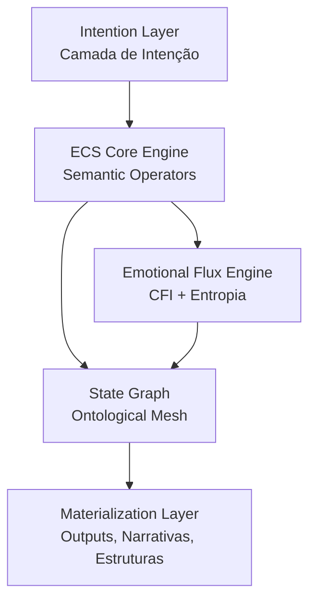
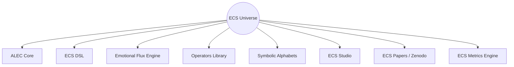

### *Meaning as Executable Matter.*

<div align="center">

<!-- Banner Animado SVG -->


</div>

---

<div align="center">

### **ECS™ — A Ontologia Executável de Significados**

[]()


<!-- Badges matemáticas -->


</div>

---

## 🎙️ **TÉCNICO-ARTÍSTICO**

> *O ECS™ é uma arquitetura simbólica para engenharia de significado —
> onde lógica, estética e ontologia convergem em um motor cognitivo unificado.*
> *Aqui, significados não são interpretados: são **executados**.*

Inspirado em linguagens formais, tradição simbólica e dinâmicas cognitivas profundas, o ECS transcende o paradigma de "texto → resposta".
Ele opera como um **motor ontológico fractal**, capaz de:

* Modelar estados mentais coerentes
* Mapear intenções
* Executar operadores simbólicos
* Materializar narrativas, estruturas e universos

---

## 🧩 **POR QUE O ECS™?**

O ECS resolve um problema central da engenharia cognitiva:

> **Como transformar significado em estrutura operacional?**

Enquanto frameworks convencionais tratam linguagem como dados, o ECS trata linguagem como **ontologia viva**, permitindo:

* Intenção → Operador
* Operador → Estado
* Estado → Materialização

É o salto entre:
**“interpretar linguagem” → “programar significado”.**

---

## 🧬 **ARQUITETURA ECS™**



A arquitetura opera em um ciclo contínuo:

1. **Intenção**
2. **Operadores**
3. **Estados Ontológicos**
4. **Materialização**

---

## 🧩 **COMPONENTES DO ECOSSISTEMA ECS™**

### **🔹 1. ALEC — Aledev Logical & Emotional Core**

Ontologia unificada que sustenta o ECS.

### **🔹 2. ECS DSL (Domain-Specific Language)**

Linguagem simbólica minimalista para expressar significado executável.

### **🔹 3. Emotional Flux Engine (EFE)**

Mede estados afetivos como parte da coerência cognitiva.

### **🔹 4. Semantic Operator Library**

Operadores fundamentais:

* `⊕` expansão
* `⊗` condensação
* `∴` causalidade simbólica
* `≡` coerência
* `ψ` vórtices narrativos

### **🔹 5. ECS Studio (future)**

Ambiente visual para criação de universos simbólicos.

### **🔹 6. ECS Metrics Engine**

Onde entram CFI, Coherence, Entropy e Density.

---

# 🧠 **MÉTRICAS DO ECS™ (MATEMÁTICA)**

### **1. CFI — Cognitive Flux Index**

[
CFI = \alpha S_c + (1 - \alpha) E_r
]

onde:

* ( S_c ) = coerência semântica
* ( E_r ) = ressonância emocional
* ( \alpha = 0.6 )

---

### **2. Semantic Coherence**

[
S_c = 1 - \frac{\Delta d}{d_{max}}
]

Medida inversamente proporcional ao desvio semântico.

---

### **3. Flux Entropy**

[
H_f = -\sum p_i \log(p_i)
]

Entropia nos estados internos durante transições.

---

### **4. Ontological Density**

[
D_o = \frac{|O|}{|N|}
]

Proporção entre operadores ativos e nós ontológicos.

---

## 🌌 **ECS™ UNIVERSE MAP**

*Sua Galáxia de Ferramentas Ontológicas*



---

## 🚀 **QUICK START**

### **Instalação**

```bash
git clone https://github.com/ale-dev/ECS.git
cd ECS
```

### **Rodando um operador simbólico**

```python
from ecs import Operator

op = Operator("⊕")
state = op("intenção de expansão")

print(state)
```

---

## 🔮 **EXEMPLOS DE USO**

### **Criar um operador**

```python
from ecs import define

@define.operator("ψ")
def vortex(x):
    return f"vórtice narrativo: {x}"
```

### **Rodar uma narrativa simbólica**

```python
from ecs import Narrative

n = Narrative("self-discovery")
n.expand("elemento arquetípico")
n.resolve()
```

---

## 📚 **DOCUMENTAÇÃO**

* Portal ECS
* Papers e Artefatos Zenodo (com DOI)
* ALEC Ontology
* Exemplos
* Tutoriais

---

### 🪞 **ALEDEV RESEARCH SEAL**

> *"Onde a ciência encontra a estética do significado."*
> ECS™ é parte da Aledev Research Initiative.

---

# 📝 **LICENÇA**

Este repositório é distribuído sob **CC-BY 4.0**.
Componentes artísticos possuem extensão de direitos conforme documentação interna.

