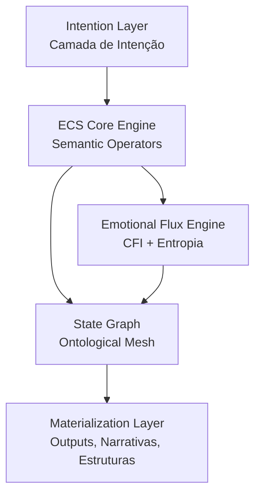
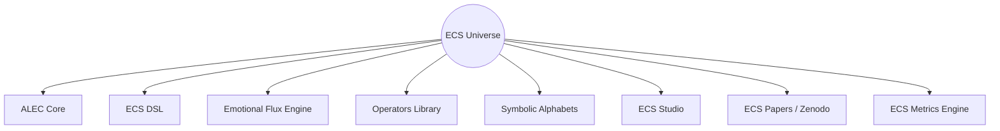

### *Meaning as Executable Matter.*

<div align="center">

<!-- Banner Animado SVG -->


</div>

---

<div align="center">

### **ECS™ — A Ontologia Executável de Significados**

[]()


<!-- Badges matemáticas -->


</div>

---

<div align="center">

[](README.md) [](README.EN.md) [](README.zh.md)

</div>

<div align="left">

<!-- Técnico-Artístico -->


</div>


> *O ECS™ é uma arquitetura simbólica para engenharia de significado —
> onde lógica, estética e ontologia convergem em um motor cognitivo unificado.*
> *Aqui, significados não são interpretados: são **executados**.*

Inspirado em linguagens formais, tradição simbólica e dinâmicas cognitivas profundas, o ECS transcende o paradigma de "texto → resposta".
Ele opera como um **motor ontológico fractal**, capaz de:

* Modelar estados mentais coerentes
* Mapear intenções
* Executar operadores simbólicos
* Materializar narrativas, estruturas e universos

---
<div align="left">

<!-- Por que o ECS -->


</div>


O ECS resolve um problema central da engenharia cognitiva:

> **Como transformar significado em estrutura operacional?**

Enquanto frameworks convencionais tratam linguagem como dados, o ECS trata linguagem como **ontologia viva**, permitindo:

* Intenção → Operador
* Operador → Estado
* Estado → Materialização

É o salto entre:
**“interpretar linguagem” → “programar significado”.**

---

<div align="left">

<!-- Arquitetura ECS -->

</div>



A arquitetura opera em um ciclo contínuo:

1. **Intenção**
2. **Operadores**
3. **Estados Ontológicos**
4. **Materialização**

---

<div align="left">

<!-- Componentes -->

</div>


<div align="center"> <table> <tr> <td align="center"><strong>🧠 ALEC</strong><br><em>Aledev Logical & Emotional Core</em></td> <td align="left">Ontologia unificada que sustenta todo o ECS — base lógica, semântica e afetiva.</td> </tr> <tr> <td align="center"><strong>🔤 ECS DSL</strong><br><em>Domain-Specific Language</em></td> <td align="left">Linguagem simbólica minimalista para expressar significado executável.</td> </tr> <tr> <td align="center"><strong>💠 EFE</strong><br><em>Emotional Flux Engine</em></td> <td align="left">Mensuração e modelagem de estados afetivos integrados à coerência cognitiva.</td> </tr> <tr> <td align="center"><strong>📐 Operadores</strong><br><em>Semantic Operator Library</em></td> <td align="left">

⊕ expansão  · 
⊗ condensação  · 
∴ causalidade  · 
≡ coerência  · 
ψ vórtices narrativos

</td> </tr> <tr> <td align="center"><strong>🧩 ECS Studio</strong><br><em>(future)</em></td> <td align="left">Ambiente visual para criação e manipulação de universos simbólicos.</td> </tr> <tr> <td align="center"><strong>📊 Metrics Engine</strong></td> <td align="left">Cálculo de CFI, Semantic Coherence, Flux Entropy e Ontological Density.</td> </tr> </table> </div>

<div align="left">

<!-- Métricas -->
-0047AB?style=for-the-badge)
</div>

<div align="center">
① CFI — Cognitive Flux Index
CFI
=
𝛼
 
𝑆
𝑐
  
+
  
(
1
−
𝛼
)
 
𝐸
𝑟
CFI=αS
c
	​

+(1−α)E
r
	​

</div>

Parâmetros

𝑆
𝑐
S
c
	​

 — coerência semântica

𝐸
𝑟
E
r
	​

 — ressonância emocional

𝛼
=
0.6
α=0.6

<div align="center">
② Semantic Coherence
𝑆
𝑐
=
1
−
Δ
𝑑
𝑑
max
⁡
S
c
	​

=1−
d
max
	​

Δd
	​

</div>

Descrição
Medida inversamente proporcional ao desvio semântico entre estados.

<div align="center">
③ Flux Entropy
𝐻
𝑓
=
−
∑
𝑖
𝑝
𝑖
log
⁡
(
𝑝
𝑖
)
H
f
	​

=−
i
∑
	​

p
i
	​

log(p
i
	​

)
</div>

Descrição
Entropia dos estados cognitivos durante transições internas.

<div align="center">
④ Ontological Density
𝐷
𝑜
=
∣
𝑂
∣
∣
𝑁
∣
D
o
	​

=
∣N∣
∣O∣
	​

</div>

Descrição
Relação entre operadores ontológicos ativos e o número total de nós disponíveis.
---

<div align="left">

<!-- Métricas -->

</div>

*Sua Galáxia de Ferramentas Ontológicas*



---


<div align="left">

<!-- Métricas -->

</div>


### **Instalação**

```bash
git clone https://github.com/ale-dev/ECS.git
cd ECS
```

### **Rodando um operador simbólico**

```python
from ecs import Operator

op = Operator("⊕")
state = op("intenção de expansão")

print(state)
```

---


<div align="left">

<!-- Métricas -->

</div>


### **Criar um operador**

```python
from ecs import define

@define.operator("ψ")
def vortex(x):
    return f"vórtice narrativo: {x}"
```

### **Rodar uma narrativa simbólica**

```python
from ecs import Narrative

n = Narrative("self-discovery")
n.expand("elemento arquetípico")
n.resolve()
```

---

<div align="left">

<!-- Métricas -->

</div>

<div align="center"> <!-- Portal ECS --> <a href="https://github.com/aleeepassarelli/ECS">  </a> <!-- Papers & Artefatos --> <a href="https://zenodo.org/search?page=1&size=20&q=ECS">  </a> <!-- ALEC Ontology --> <a href="https://github.com/aleeepassarelli/ECS/tree/main/ALEC">  </a> <!-- Exemplos --> <a href="https://github.com/aleeepassarelli/ECS/tree/main/examples">  </a> <!-- Tutoriais --> <a href="https://github.com/aleeepassarelli/ECS/tree/main/tutorials">  </a> </div>

---

<p align="center">
  <sub>
  Desenvolvido com 🧠 + 🜂 por <b>Aledev</b> • 
  <a href="https://github.com/aleeepassarelli">GitHub</a> • 
  <a href="mailto:al.passarelli@gmail.com">Email</a> • 
  <a href="https://x.com/alpassarelli">Twitter</a>
  </sub>
</p>

## **⭐ Se este framework foi útil, considere dar uma estrela no GitHub!**

---

### 📝 **LICENÇA**

Este repositório é distribuído sob **CC-BY 4.0**.
Componentes artísticos possuem extensão de direitos conforme documentação interna.


<p align="center">
  
</p>


