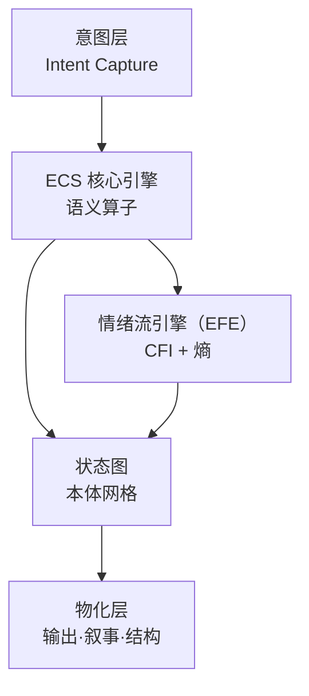
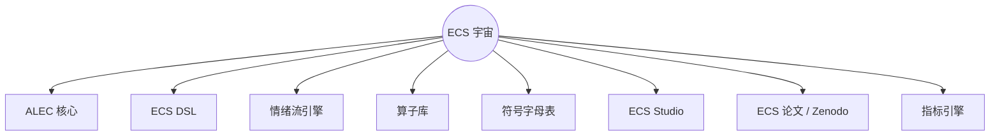

### *意义即可执行的结构。*

<div align="center">


</div>

---

<div align="center">

### **ECS™ — 可执行本体论框架（Executable Cognitive Semantics）**


<!-- Math Badges -->


</div>

---

<div align="left">


</div>

> *ECS™ 是用于工程化 “意义” 的符号架构——
> 在这里，逻辑、美学与本体论合为一体。*
> *语言不再被“解释”：它被 **执行**。*

ECS 受形式语言学、符号传统与认知动力学启发，超越了传统的“文本 → 回答”范式。
它是一种 **分形本体引擎**，能够：

* 建模语义一致的认知状态
* 映射意图
* 执行符号算子
* 生成叙事、结构与完整语义宇宙

---

<div align="left">


</div>

核心问题：

> **如何将 “意义” 转化为可操作的结构？**

传统框架把语言当作数据。
ECS 把语言当作 **活的本体**。

这带来三层转换：

* 意图 → 算子
* 算子 → 状态
* 状态 → 物化内容

这是从
**“理解语言” → “编程意义”**
的跃迁。

---

<div align="left">


</div>



循环结构：

1. 意图（Intention）
2. 算子（Operators）
3. 本体状态（Ontological States）
4. 物化（Materialization）

---

<div align="left">


</div>

<div align="center">
<table>
<tr>
<td align="center"><strong>🧠 ALEC</strong><br><em>Aledev 逻辑与情绪核心</em></td>
<td align="left">支撑 ECS 的统一本体：逻辑、语义与情绪的基石。</td>
</tr>
<tr>
<td align="center"><strong>🔤 ECS DSL</strong></td>
<td align="left">极简符号语言，用于表达 “可执行的意义”。</td>
</tr>
<tr>
<td align="center"><strong>💠 EFE</strong></td>
<td align="left">将情绪动力学整合到认知一致性之中。</td>
</tr>
<tr>
<td align="center"><strong>📐 语义算子</strong></td>
<td align="left">
⊕ 扩展 ·  
⊗ 凝缩 ·  
∴ 符号因果 ·  
≡ 一致性 ·  
ψ 叙事涡旋
</td>
</tr>
<tr>
<td align="center"><strong>🧩 ECS Studio</strong><br><em>（未来）</em></td>
<td align="left">从可视化角度构建符号宇宙。</td>
</tr>
<tr>
<td align="center"><strong>📊 指标引擎</strong></td>
<td align="left">计算 CFI、语义一致性、流熵、本体密度。</td>
</tr>
</table>
</div>

---

<div align="left">


</div>

<div align="center">

### ① **CFI — 认知流指数**

[
CFI = \alpha S_c + (1 - \alpha) E_r
]

</div>

参数：

* (S_c)：语义一致性
* (E_r)：情感共鸣
* (\alpha = 0.6)

---

<div align="center">

### ② **语义一致性（Semantic Coherence）**

[
S_c = 1 - \frac{\Delta d}{d_{\max}}
]

</div>

衡量语义偏差的反比。

---

<div align="center">

### ③ **流熵（Flux Entropy）**

[
H_f = -\sum_i p_i \log(p_i)
]

</div>

认知状态在内部转移时的熵度量。

---

<div align="center">

### ④ **本体密度（Ontological Density）**

[
D_o = \frac{|O|}{|N|}
]

</div>

活跃算子与本体节点的比例。

---

<div align="left">


</div>



---

<div align="left">


</div>

### 安装

```bash
git clone https://github.com/ale-dev/ECS.git
cd ECS
```

### 运行符号算子

```python
from ecs import Operator

op = Operator("⊕")
state = op("扩展意图")

print(state)
```

---

<div align="left">


</div>

### 创建算子

```python
from ecs import define

@define.operator("ψ")
def vortex(x):
    return f"叙事涡旋: {x}"
```

### 运行叙事

```python
from ecs import Narrative

n = Narrative("self-discovery")
n.expand("archetypal element")
n.resolve()
```

---

<div align="left">


</div>

<div align="center">

<a href="https://github.com/aleeepassarelli/ECS">
  
</a>

<a href="https://zenodo.org/search?page=1&size=20&q=ECS">
  
</a>

<a href="https://github.com/aleeepassarelli/ECS/tree/main/ALEC">
  
</a>

<a href="https://github.com/aleeepassarelli/ECS/tree/main/examples">
  
</a>

<a href="https://github.com/aleeepassarelli/ECS/tree/main/tutorials">
  
</a>

</div>

---

<p align="center">
  <sub>
  由 🧠 + 🜂 驱动 • <b>Aledev</b>  
  <a href="https://github.com/aleeepassarelli">GitHub</a> • 
  <a href="mailto:al.passarelli@gmail.com">Email</a> • 
  <a href="https://x.com/alpassarelli">Twitter</a>
  </sub>
</p>

---

<p align="center">
  
</p>

